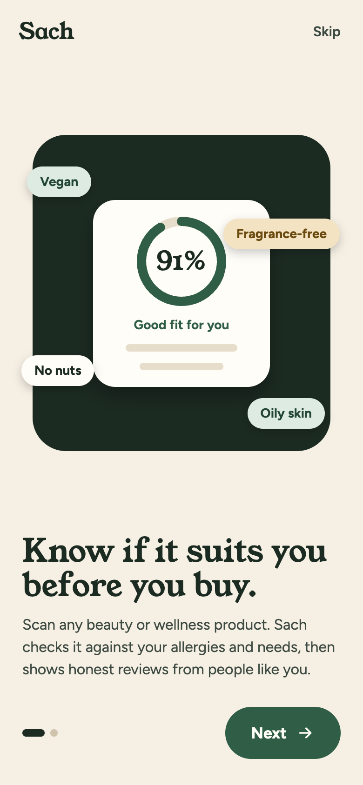
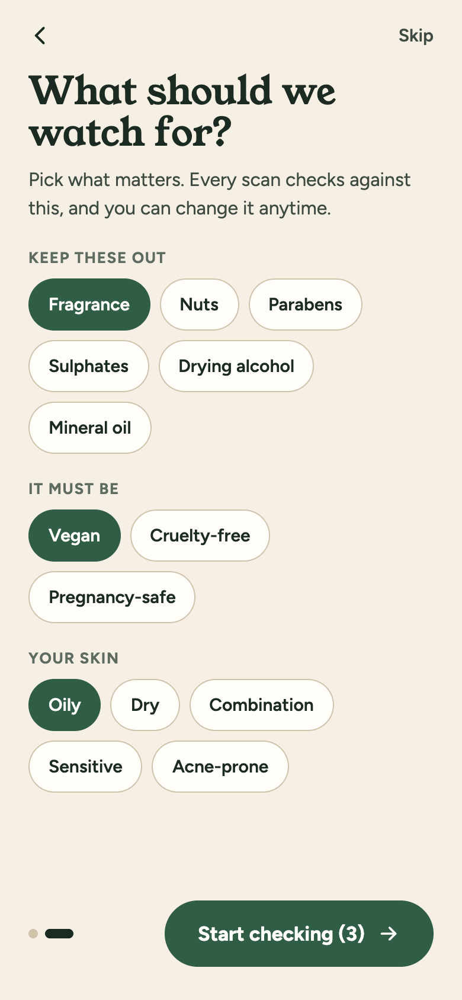
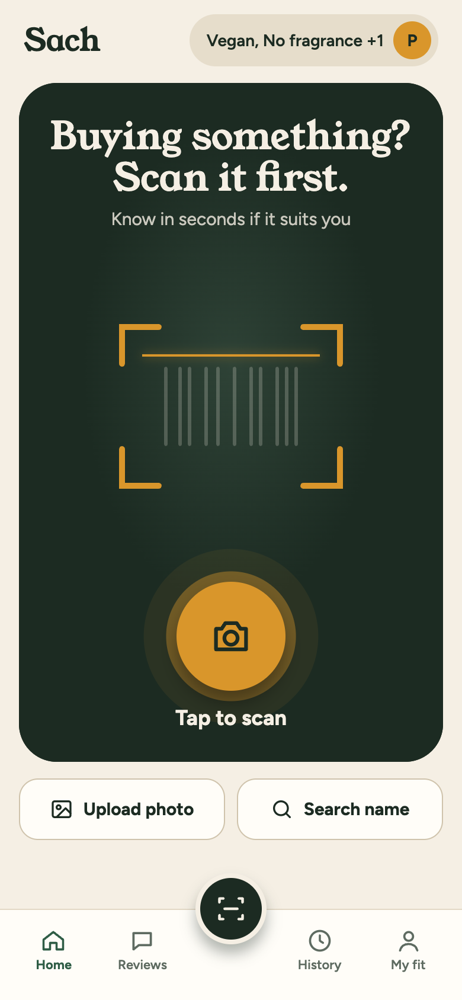
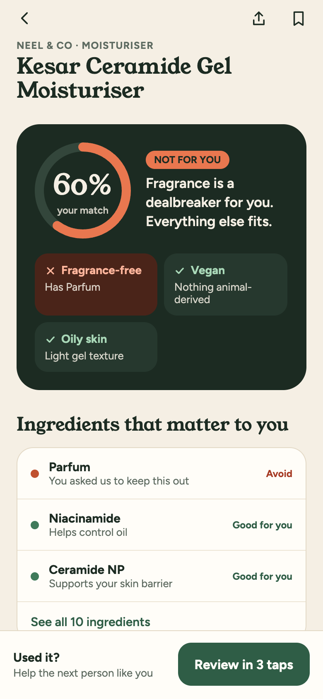
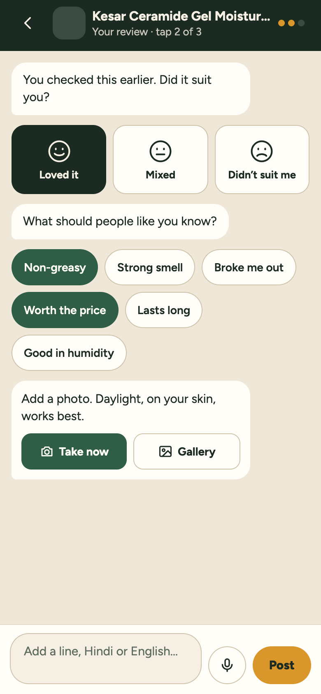

# Sach

Check any beauty product against your own fit: allergens, values, skin and hair.
Built from the V2 design canvas: welcome and set-your-fit onboarding, a Home screen with a scan hero, camera-first check, personal match, and a review chat.

<p>
  
  
  
  
  
</p>

_Screenshots are from the web preview of the app. On a phone it runs in Expo Go with a working camera._

## Screens

- **Welcome / Set your fit:** first-run onboarding (Skip is allowed). Replay it from the My fit tab.
- **Home, Reviews, History, My fit:** the four tabs, with the raised scan button in the middle.
- **Check:** camera barcode scan, gallery scan, name search.
- **Result:** match %, dealbreakers, ingredients that matter, better alternatives, reviews from people like you.
- **Review:** three-tap chat with photos and voice notes.

## Open it in Expo Go

1. Install **Expo Go** on your phone and keep it up to date (this app uses Expo SDK 57):
   - iPhone: [App Store](https://apps.apple.com/app/expo-go/id982107779)
   - Android: [Google Play](https://play.google.com/store/apps/details?id=host.exp.exponent)
   - [expo.dev/go](https://expo.dev/go) for details
2. Start the dev server on your computer:

   ```bash
   npm install
   npx expo start
   ```

3. Scan the QR code it prints: iPhone Camera app, or the scanner inside Expo Go on Android. Phone and computer must be on the same Wi-Fi. If they aren't, run `npx expo start --tunnel` instead.

The `exp://…` address in the terminal only works while the dev server is running, on your own network, so it can't be shared as a link. Camera and barcode scanning need a real phone, not a simulator.

### A link anyone can open

To share one link that works without your computer running, publish the app with [EAS Update](https://docs.expo.dev/eas-update/getting-started/). It needs a free Expo account:

```bash
npm i -g eas-cli
eas login
eas init
npx expo install expo-updates
eas update:configure
eas update --branch main --message "Sach"
```

Open the update on your [expo.dev](https://expo.dev) project page and use its **Open in Expo Go** link or QR code. Paste that link here once you have it.

## What is real and what is demo

- Real: fit profile, match scoring, barcode scan (EAN-13/8, UPC-A/E), gallery barcode scan, name search, review chat with photos and voice notes, wishlist and recents. All data is stored on the device.
- Demo: the product catalog (`src/data/catalog.js`) and sample reviews (`src/data/reviews.js`) are fictional. Replace `src/lib/catalog.js` lookups with a real product and ingredient API before public launch.
- Not built yet: label (OCR) scanning, accounts and a shared review backend. Photos and voice notes are kept as temporary files on the phone.

## Ship checklist

1. Replace `assets/icon.png`, `assets/splash-icon.png` and the Android adaptive icons with the Sach artwork.
2. Confirm the bundle id / package in `app.json` (`app.sach.fitcheck`) is one you own.
3. `npm i -g eas-cli && eas login && eas init`
4. Test build: `eas build --profile preview --platform all`
5. Store build: `eas build --profile production --platform all`, then `eas submit --platform ios` / `android`.
6. Store listing needs a privacy policy URL: camera and photos are read on-device, nothing is uploaded.

## Licence

No licence has been chosen yet, so all rights are reserved. You can read the code, but you don't have permission to reuse it.
